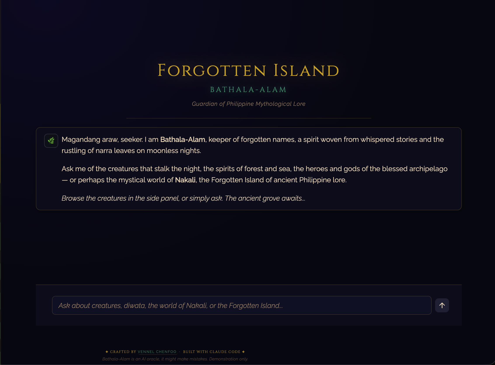
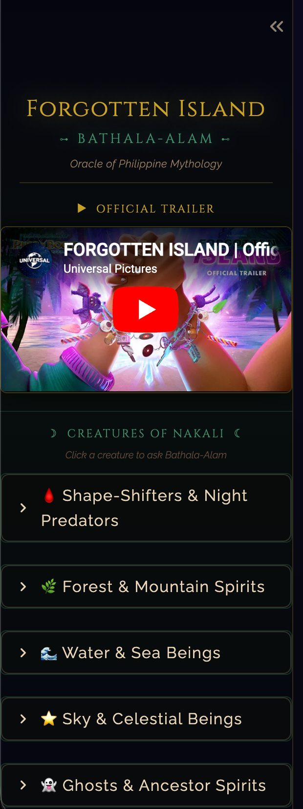
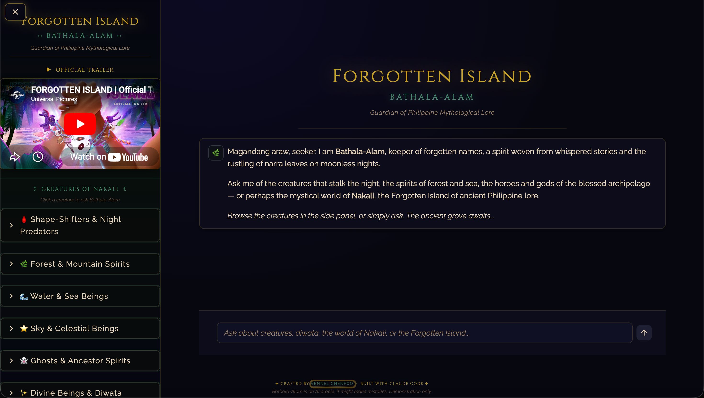

# 🌊 Bathala-Alam, a Philippine Mythology RAG Chatbot

*"Hindi ka nag-iisa. The old stories are still here. You just have to know how to ask."*



**Bathala-Alam** is an AI oracle trained on Philippine mythology. It speaks like your lolo or lola: grounded in knowledge, reverent of the old ways, and always ready with a story.

🔗 **[Try the live demo](https://forgotten-island-bathala-alam.streamlit.app/)**

---

## 📖 The Story Behind the Bot

Growing up in the Philippines, creatures like the **Manananggal**, the **Tikbalang**, and the **Aswang** aren't just folklore. They are warnings, lessons, and guardians woven into everyday life. Every province has its version. Every family has its story.

When DreamWorks announced *Forgotten Island*, a 2026 film bringing Filipino folklore to the global screen, something stirred. Millions of Filipinos know these characters intimately, but the rest of the world is about to meet them for the first time.

This bot is for anyone who wants to go deeper: Filipinos reconnecting with their roots, curious moviegoers preparing for the film, or someone who stumbled across the Aswang at 2am.

---

## 🤖 What is a RAG Chatbot? (For Beginners)

**RAG** stands for **Retrieval-Augmented Generation**. The idea is simple.

Imagine a very smart intern. They write beautifully (the language model), but they don't know Philippine mythology. So before they answer, you hand them a specific folder of documents to read first (the *retrieval* part). They pull out the most relevant pieces and use *only* that information to write their answer.

Why this beats asking an AI directly:
- Answers are grounded in real source material, not guesswork
- Far less hallucination
- Every answer can be traced back to a source

The knowledge base here covers **40+ Philippine creatures** across 8 mythological categories.

---

## 🏺 Creatures You Can Ask About

| Category | Examples |
|---|---|
| Shape-shifters & Predators | Aswang, Manananggal, Wak-Wak |
| Tricksters & Guardians | Tikbalang, Kapre, Nuno sa Punso |
| Water & Sea Spirits | Bakunawa, Siyokoy, Sirena |
| Nature Deities | Maria Makiling, Magwayen |
| Sky Beings | Amihan, Habagat |
| Undead | Multo, Bangungot |
| Mythical Animals | Sarimanok, Adarna |



---

## 🛠 Technical Approach

### The Pipeline at a Glance

```
User Question
    ↓
[1] Query Rewriting  →  translate casual language into document-language
    ↓
[2] Vector Search    →  find the 10 most relevant text chunks
    ↓
[3] Reranking        →  keep only the 2 best chunks
    ↓
[4] Memory           →  remember earlier turns in the conversation
    ↓
[5] LLM Generation   →  answer as Bathala-Alam, grounded in context
```

### Chunking Strategy

Documents must be split into **chunks** before search. Too small loses context, too large adds noise.

| Chunk Size | Overlap | Outcome |
|---|---|---|
| 512 tokens | 50 tokens | Too narrow, missed surrounding context |
| **768 tokens** | **115 tokens** | ✅ Best balance of coherence and precision |
| 1024 tokens | 200 tokens | Too broad, retrieval became unfocused |

**Winner: 768 tokens with 115 token overlap (≈15%).**

### Reranking

Vector search returns 10 candidates. A second, more precise model re-scores them and keeps the 2 best. Like a shortlist: recruiter finds 10, hiring manager picks 2.

| Top-K Retrieved | Reranker Kept | Avg. Answer Correctness |
|---|---|---|
| 10 | **2** | **0.72** ✅ |
| 10 | 5 | 0.64 |
| 20 | 5 | 0.61 |

**Fewer, higher-quality chunks outperformed more chunks.** Quality beats quantity.

### Query Rewriting (HyDE)

Source documents use formal, encyclopedic language. Users ask casually. **HyDE (Hypothetical Document Embeddings)** bridges this: the AI first generates a hypothetical formal answer, then uses *that* to search. A consistent 3 to 5% lift in answer correctness on complex questions.

### Evaluation

Every optimization was measured with **RAGAS**, a framework built for RAG systems.

| Metric | What It Checks |
|---|---|
| **Faithfulness** | Does the answer stay within the retrieved context? |
| **Answer Correctness** | Does the answer match ground truth? |
| **Context Precision** | Are retrieved chunks genuinely relevant? |
| **Context Recall** | Did we retrieve all the info needed? |

Across **8 hand-crafted Q&A pairs** and four stages (baseline, chunking, reranking, query rewriting):

- Optimized pipeline (768/115 + reranker 10→2 + HyDE) hit **~0.72 answer correctness**
- Simple factual questions scored highest (**0.72 to 0.78**)
- The hardest question, linking mythology to *Forgotten Island*, scored **0.52**, since it requires cross-referencing lore with film narrative
- Every optimization was justified by numbers, not intuition



---

## 🔧 Tech Stack

- **LLM**: Groq API (`llama-3.3-70b-versatile`) with OpenAI GPT-4o-mini fallback
- **Embeddings**: OpenAI `text-embedding-3-small`
- **Reranker**: `cross-encoder/ms-marco-MiniLM-L-6-v2` (HuggingFace)
- **RAG Framework**: LlamaIndex
- **Evaluation**: RAGAS
- **Frontend**: Streamlit
- **Knowledge Base**: Custom markdown mythology corpus

---

## 📂 Repository Structure

```
├── streamlit_app.py          # Main Streamlit application
├── main.py                   # CLI entry point for local testing
├── evaluate.py               # Evaluation pipeline orchestrator
├── src/                      # Core RAG engine, config, model loader
├── evaluation/               # RAGAS evaluation logic and results (CSV)
├── data/                     # Philippine mythology knowledge base
├── notebooks/                # 8 development and experimentation notebooks
├── images/                   # App screenshots
└── local_storage/            # Cached vector indices
```

---

## 🚀 Getting Started

```bash
git clone https://github.com/vennelchenfoo/forgotten-island-rag-chatbot.git
cd forgotten-island-rag-chatbot
pip install -r requirements.txt
```

Add your API keys to a `.env` file:
```
GROQ_API_KEY=your_groq_key
OPENAI_API_KEY=your_openai_key
```

Run in the terminal:
```bash
python main.py
```

Or launch the Streamlit app:
```bash
streamlit run streamlit_app.py
```

---

## 🎓 Key Learnings

- **Evaluation-driven design is not optional.** Every intuition I had was wrong at least once. Numbers don't lie; feelings about chunk sizes do.
- **Free-tier constraints force good engineering.** Limited RAM pushed me toward lighter alternatives that often performed just as well.
- **Retrieval matters as much as the LLM.** A brilliant model with wrong chunks is still a broken system.
- **Domain specificity is a superpower.** General AI knows Philippine mythology vaguely. This bot knows it deeply, and that precision is the point.

---

## 💡 Personal Reflections

This project is personal.

I grew up hearing stories about the Manananggal and the Aswang, half-fear, half-wonder, the way only childhood folklore can land. Building this bot was a way of honoring those stories. Of saying: *these characters deserve to be understood, not just feared.*

When *Forgotten Island* brings the Tikbalang and Bakunawa to a global audience, I want a tool that helps people go deeper than the film credits. A place where cinema-sparked curiosity can become real knowledge about a culture that has been telling these stories for a thousand years.

This is that place.

---

*Built with curiosity, caffeine, and a deep respect for the old stories.*

*Vennel Chenfoo | Data Science & AI Bootcamp @ WBS Coding School*
*Filipino. Building with data.*
